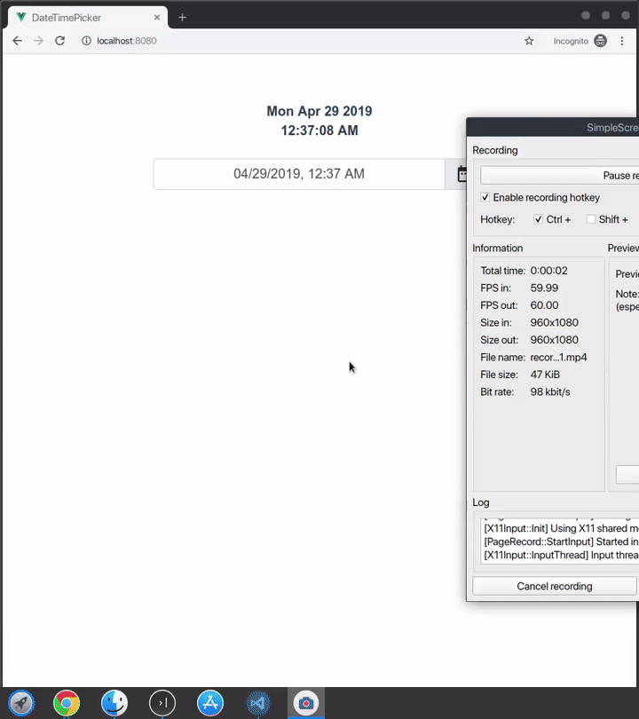

# SIMPLE VUE 2 DATE TIME PICKER

Vue.js component for easy date and time picking.



## Installation
```bash
# npm
npm i simple-vue2-datetimepicker
```
```bash
# yarn
yarn add simple-vue2-datetimepicker
```

## Usage
### Component
```html

<template>
<div id="app">
    <datetimepicker v-model="myDate"></datetimepicker>
</div>
</template>

<script>
import SimpleVue2DateTimePicker from 'simple-vue2-datetimepicker';

export default {
    name: 'App',
    components: {
        datetimepicker: SimpleVue2DateTimePicker
    },
    data() {
        return {
            myDate: new Date(),
            options: {
                // defaults
                locale: 'en-US', // for date string formatting
                militaryTime: false, // enabled uses 24 hour time
                startDay: 'Sunday' // set week day start
            }
        }
    }
}
</script>
```
### Plugin

```javascript
import SimpleVue2DateTimePicker from 'simple-vue2-datetimepicker';
Vue.use(SimpleVue2DateTimePicker);
```

## Development
- clone this repository
- install dependencies
- start the webpack development server with `yarn serve` or `npm run serve`
- go to `http://localhost:8080` in your browser
